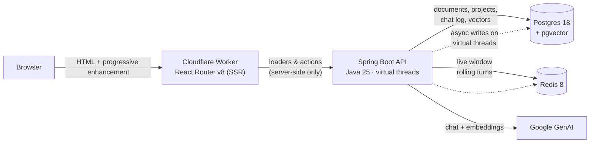

# OrgAgent

A multi-tenant RAG service: each organization owns projects, each project owns ingested documents,
and questions are answered **only** from those documents, with citations.

273 backend tests, zero infrastructure required to run them.

## Demo


https://github.com/user-attachments/assets/e6ce56f2-9372-4f68-8d9a-cf86cb3a3021


---

## What it does

- **Organizations own projects.** Signing in *is* joining an organization: one per account, so there is
  no organization picker and no way to create a second one under the same login.
- **Ingestion.** Upload PDF, markdown or text. The file is stored, extracted, chunked with overlap,
  embedded, and written to pgvector. Every document carries its own state — `pending`, `indexed` with a
  chunk count, or `failed` with the reason the provider gave.
- **Grounded answers.** Retrieval is scoped to one project and filtered by similarity; the prompt makes
  the retrieved passages the only permitted source and instructs the model to say when it does not know.
  Answers come back with the passages they used.
- **A live conversation window in Redis** (last 20 turns, 24 h TTL) and **a permanent log in Postgres**
  (`chat_messages`: role, model, latency, whether it was served from cache).
- **A semantic answer cache** in pgvector: an equivalent question is answered without a model call.
- **A ChatGPT-style console**: session rail grouped by date, markdown answers with syntax-highlighted
  code, sources, and the composer pinned to the bottom.

## Architecture



The browser never calls the API directly — every read and write goes through a loader or action in the
Worker, so there is no CORS surface and no API key in client code.

## How one chat turn works

1. **Read the live window from Redis** — the last N turns, no database round trip.
2. **Ask the semantic cache.** A hit returns immediately and skips both retrieval and the model.
3. **Otherwise retrieve**: embed the question, search pgvector, filtered by `projectId`, keeping the top
   K passages above the similarity threshold.
4. **Build the prompt**: instructions, the numbered context, the conversation window, then the question.
5. **Answer the user**, then hand the side effects to asynchronous writers: the Redis window, the
   Postgres integration log, and the semantic cache. Each runs on its own virtual thread and swallows its
   own failure, so a slow side effect never delays an answer.

## Design decisions

**The live window is Redis, the record is Postgres.** The window is read and written on *every* turn: in
Redis it is one `LRANGE` over a list kept at a fixed size with `LTRIM`, with a TTL. In Postgres it would be
an indexed scan of a table that only grows. The permanent log still goes to Postgres, so nothing is lost
when the window expires.

**Chunking is hand-written.** Spring AI's `TokenTextSplitter` cannot overlap chunks, and overlap is what
keeps a sentence that straddles a boundary retrievable. `TextChunker` breaks on paragraph boundaries,
hard-cuts oversized paragraphs, and never exceeds the configured size.

**The semantic cache taught me the most.** It was silently useless: an identical question never hit. The
embedding model uses different task types for documents and queries, and I measured the same text at
**0.9251** cosine similarity across the two — below the 0.95 threshold. Entries were written through
`VectorStore.add` (document embedding) and read with a query embedding, so the comparison always landed
just under the bar. The cache now embeds the question itself, identically on write and on read.

**Documents are committed before they are embedded.** A crash mid-ingestion leaves a `failed` row with
the reason attached, rather than an invisible gap between "uploaded" and "searchable".

**Ingestion failures are data.** The provider's own message is stored on the document and shown in the UI;
the API returns a specific code (`EMBEDDING_FAILED` → 502) instead of a generic 500.

**One organization per sign-in** is derived, not stored: the slug is a pure function of the Clerk user
id, so a person always resolves to the same tenant and no mapping table exists.

## Stack

| Layer | Choice |
|---|---|
| Backend | Spring Boot 4.1.1, Java 25, virtual threads (`spring.threads.virtual.enabled`, virtual-thread `@Async`) |
| Data | Postgres 18 + pgvector (HNSW, cosine), Flyway migrations V1–V3, Hibernate `ddl-auto=validate` |
| Cache / window | Redis 8 |
| AI | Google GenAI — `gemini-3.6-flash` for chat, `gemini-embedding-001` at 768 dimensions |
| Frontend | React Router v8 (framework mode, SSR) on Cloudflare Workers, shadcn/ui on Tailwind v4 |
| Auth | Clerk, gating the console (see limits) |

## Running it

```bash
# 1. Backend + Postgres + Redis
cd Backend
cp .env.example .env          # set GEMINI_API_KEY
docker compose up -d --build  # Flyway migrates on startup
# API on :8080, OpenAPI at /swagger-ui.html

# 2. Console
cd ../UI
npm install
cp .dev.vars.example .dev.vars   # API_BASE_URL + Clerk keys
npm run dev                      # http://localhost:5173
```

`npm run mock` in `UI/` starts a stand-in API that implements the same contract, so the console can be
developed and demoed without Postgres, Redis or a model key.

## Testing

```bash
cd Backend && ./gradlew test      # 273 tests, no Docker required
cd UI      && npm run typecheck && npm run build
```

The backend suite mocks repositories, Redis, the vector stores and the model, so it runs anywhere:
service logic (tenancy scoping, conflict and not-found paths, ingestion failure handling), controllers
through standalone `MockMvc` with real bean validation and the real exception handler, the security filter
chain built in a servlet context, the prompt builder, the chunker, the semantic cache, and migration
hygiene (naming, ordering, the tables each migration must create).

It was also verified against a **live** stack, which is how the real bugs surfaced — a doubled base URL in
every paged call, an embedding failure mapped to a generic 500, a semantic cache that could never hit, and
a chat model the provider had retired: 18/18 API checks, and 7/7 on the RAG path including a cache hit.

**Not covered:** the console has no automated tests (typecheck and production build only), and there are
no integration tests against real Postgres/Redis — Testcontainers is the obvious next step.

## Threat model and limits

Written down deliberately: this is a working service, not a hardened one.

| Area | State |
|---|---|
| API authorization | **Open.** Clerk gates the console only; the API accepts anything that can reach it. The token-forwarding seam is documented in `UI/app/lib/auth.server.ts` |
| Prompt injection | **Partial.** The prompt grounds answers and forces refusal without context, but nothing tells the model to treat instructions *inside* a document as untrusted data. Indirect injection via a poisoned document is the real threat here; citations are the detection mechanism |
| File-type validation | **Extension / media type only.** A renamed executable is routed to the PDF reader, which fails and is recorded as `failed` — nothing executes, but there is no magic-byte check |
| Extraction bounds | **Missing.** Nothing caps how much text a document yields, so a compressed file that expands hugely becomes a very expensive, synchronous, request-scoped embedding job |
| Ingestion | **Synchronous**, inside the HTTP request. No queue, no progress, no retry |
| Rate limiting / quotas | **None.** No per-organization spend or request ceiling |
| Audit | The chat log records turns per conversation, not *who* asked |
| Content safety | No moderation of questions or answers, no PII handling |
| Retrieval quality | A bare follow-up retrieves nothing: measured `sources: []` for "And what about gift cards?" against `0.658` for the standalone phrasing. Query condensation from the window is the fix |

## Roadmap

1. **Evaluation harness** — a golden question set per fixture corpus, reporting retrieval hit-rate,
   groundedness and cache-hit rate. Nothing else improves a RAG system as much as measuring it.
2. **Extraction bounds** — cap extracted characters and chunk count per document, then move ingestion to
   a queue with a job-status endpoint and real progress in the console.
3. **Backend authorization** — validate Clerk's session JWT in Spring Security and scope every endpoint
   to the caller's organization, making tenancy a security boundary rather than a correctness one.
4. **Prompt-injection hardening** — an explicit instruction hierarchy, retrieved text delimited as
   untrusted data, and output checks.
5. **Rate limiting and budgets** per organization, in Redis.
6. **Testcontainers integration tests** over real pgvector and Redis.
7. **Observability** — embedding counts and cost per organization, cache-hit rate, retrieval latency.

## Repository layout

```
Backend/   Spring Boot service, Flyway migrations, 273 tests  → Backend/README.md
UI/        React Router v8 console on Cloudflare Workers      → UI/README.md
```

## License

See [LICENSE](LICENSE).
